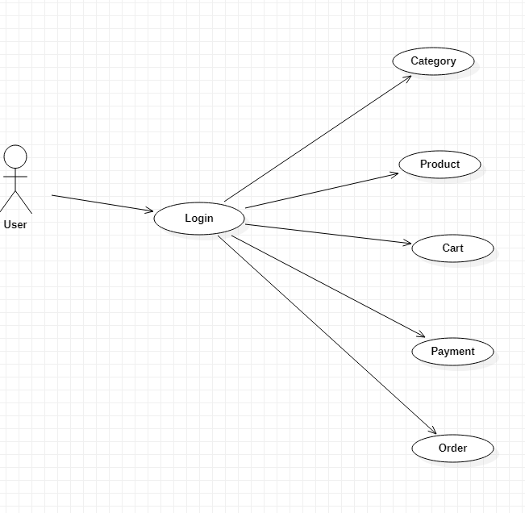

**HIGH - LEVEL DESIGN**

**PROPOSED SYSTEM :**

- High – level design explains the system architecture that would be used for developing a software product. 
- The architecture diagram provides an overview of an entire system, identifying the man components that would be developed for the product and their interfaces.
- All the data flows, flowcharts, etc are in these documents. So that developers can understand how the system is expected to work with regards to the features.

**USE CASE DIAGRAM :**

Behavioural

