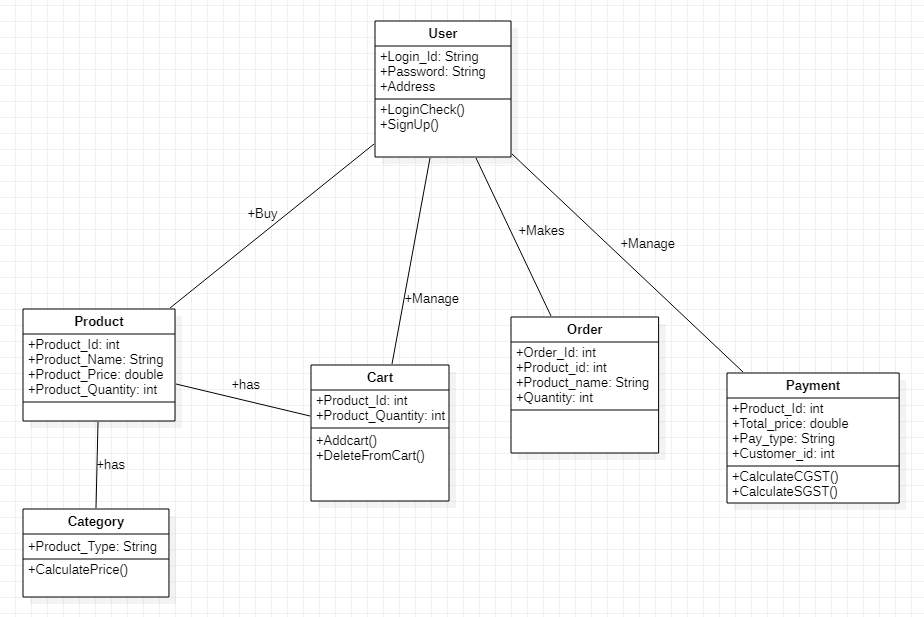

**LOW – LEVEL DESIGN**

**PROPOSED SYSTEM** :

Low – level design is a component – level design process that follows a step-by-step refinement process. 

This process can be used for designing data structures, required software architecture, source code.

The data organization may be defined requirement analysis and then refined during data design work.

**CLASS DIAGRAM :**

